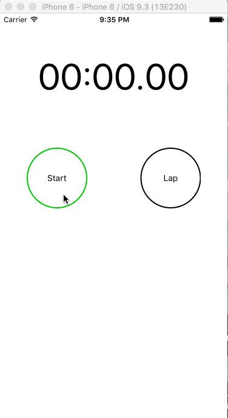

# React Native Stopwatch

[](http://standardjs.com/)

## Screenshot



## Getting Started

```bash
git clone https://github.com/LIYINGZHEN/react-native-stopwatch
```

Go to project folder

```bash
cd react-native-stopwatch
```

Install packages

```bash
npm install
```

Start the project

```bash
react-native start
react-native run-ios
```
